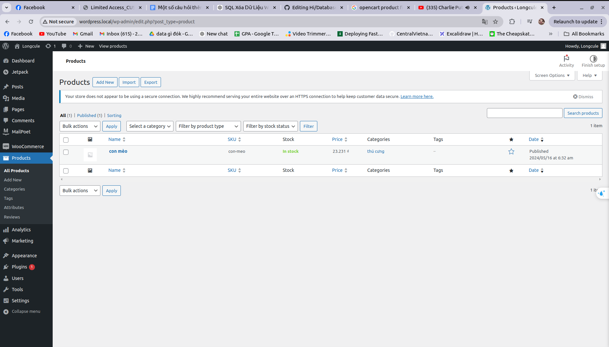
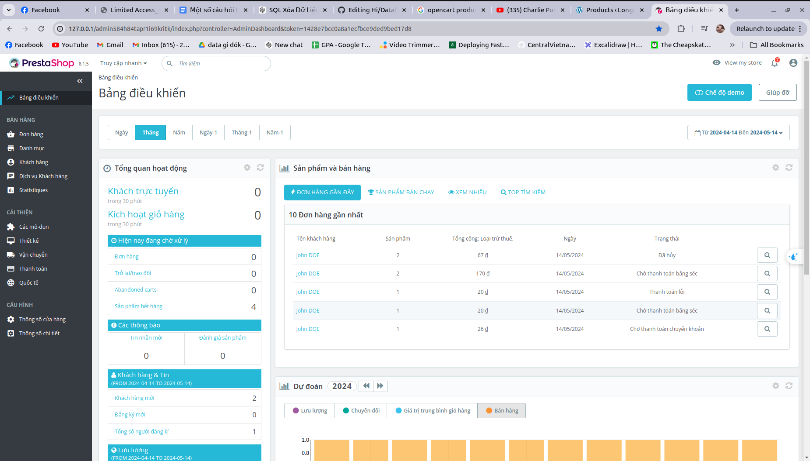
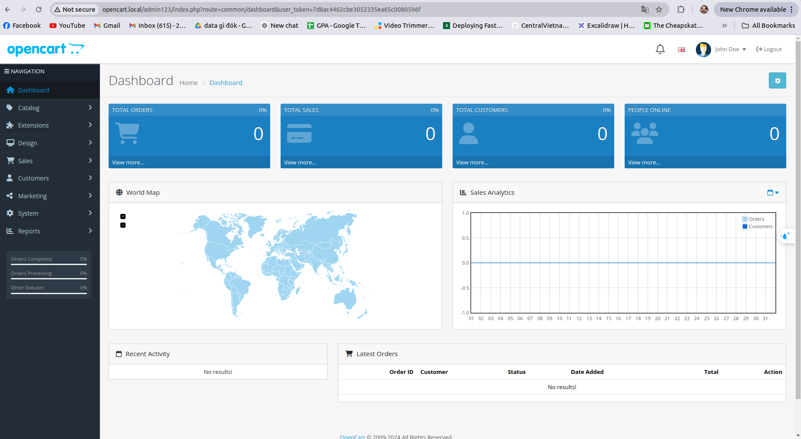
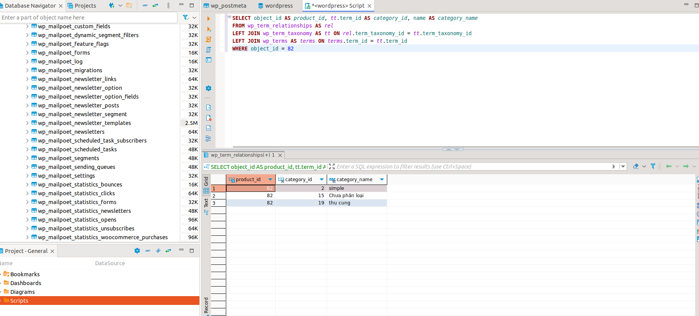
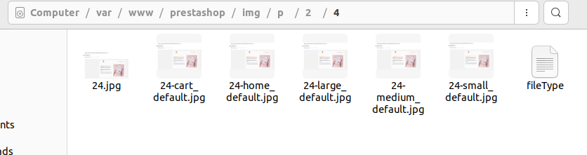
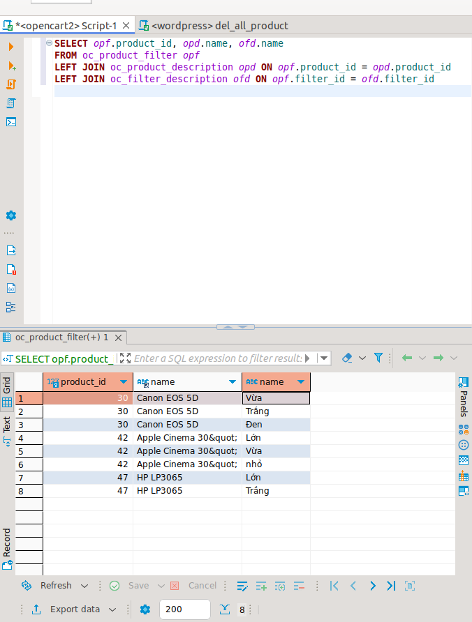
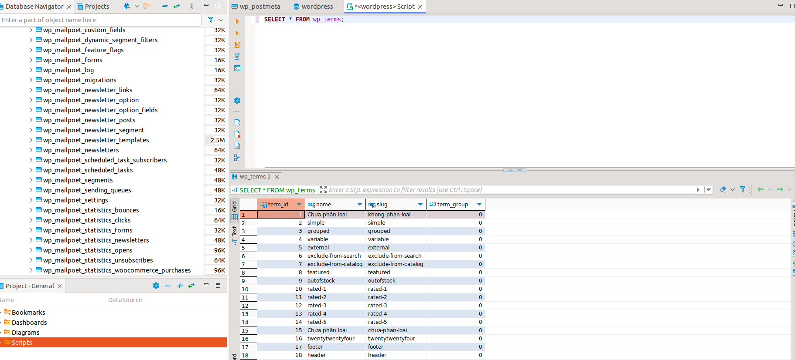
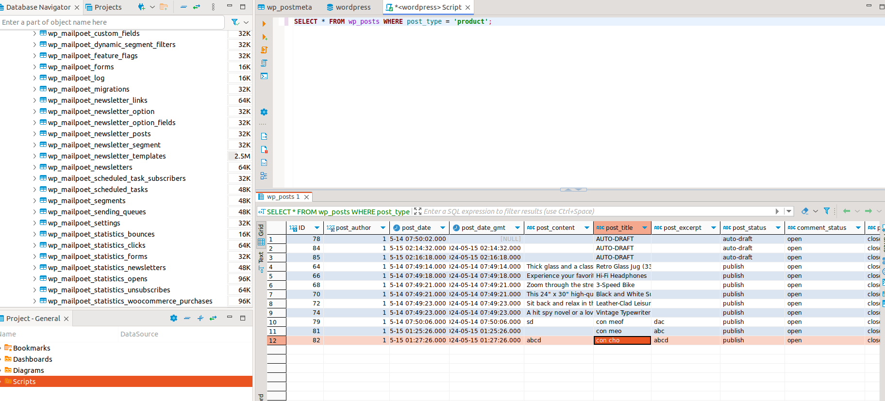
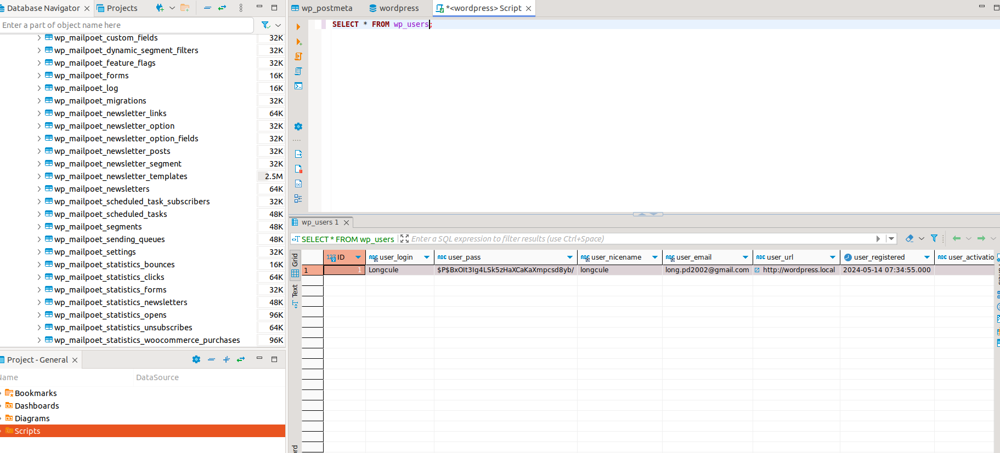
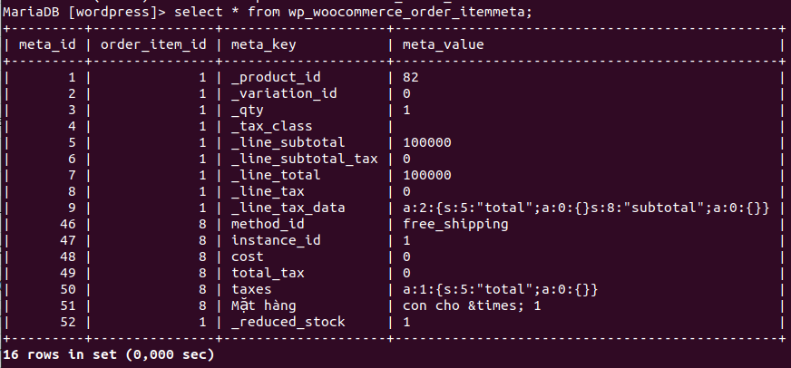

# Cài đặt:





# Bài tập về cách lưu dữ liệu trong Shopping Cart
- Sau khi đã cài đặt và tìm hiểu quá về các Shopping Cart, hãy kể tên các bảng lưu thông tin của các entity sau (Category, Product, Customer, Order) của một Shopping Cart bất kỳ (Magento, WooCommere, PrestaShop)

Ví dụ: 
Thông tin product lưu trong các bảng: products, product_category,...
## WooCommerce
- Ảnh của product được lưu như nào trong database?

  Ảnh sẽ được save vào folder trong src và trong wp_posts có trường guid lưu đường dẫn đến ảnh.
  
- Category link với product như nào? Viết câu query để lấy ra toàn bộ category name của một products với ID cho trước.

  Category link với product thông qua bảng wp_term_relationships khi add product vào category

  Query:
  ```
  SELECT object_id AS product_id, tt.term_id AS category_id, name AS category_name
  FROM wp_term_relationships AS rel
  LEFT JOIN wp_term_taxonomy AS tt ON rel.term_taxonomy_id = tt.term_taxonomy_id
  LEFT JOIN wp_terms AS terms ON terms.term_id = tt.term_id
  WHERE object_id = 82
  ```

- Nêu cách để attribute tạo product variants.
đầu tiên là tạo thuộc tính -> khi thêm thì thuộc tính sẽ được lưu vào bảng wp_term_taxonomy(term_taxonomy_id, term_id, taxonomy(loại term, với atributes thì có pa_ ở đầu),...) và wp_term(term_id, name, slug(kiểu link SEO),...). Khi thêm sản phẩm với và chọn thuộc tính vừa tạo(vd color), trong bảng wp_term_relationships sẽ thêm row mới biểu hiện mối quan hệ của sản phẩm và thuộc tính, gồm có object_id(id sản phẩm) và term_taxonomy_id(id thuộc tính), qua đây biểu hiện được sản phẩm có thuộc tính đó.

- Viết câu query xoá sạch order + product
Query xóa product:
```
DELETE relations.*, taxes.*, terms.*
FROM wp_term_relationships AS relations
INNER JOIN wp_term_taxonomy AS taxes
ON relations.term_taxonomy_id=taxes.term_taxonomy_id
INNER JOIN wp_terms AS terms
ON taxes.term_id=terms.term_id
WHERE object_id IN (SELECT ID FROM wp_posts WHERE post_type='product');

DELETE FROM wp_postmeta WHERE post_id IN (SELECT ID FROM wp_posts WHERE post_type = 'product');
DELETE FROM wp_posts WHERE post_type = 'product';
```

Query xóa orders:
```
DELETE FROM wp_woocommerce_order_itemmeta;
DELETE FROM wp_woocommerce_order_items;
DELETE FROM wp_wc_orders;
DELETE FROM wp_wc_order_addresses;
DELETE FROM wp_wc_order_coupon_lookup;
DELETE FROM wp_wc_order_operational_data;
DELETE FROM wp_wc_order_product_lookup;
DELETE FROM wp_wc_orders_meta;
DELETE FROM wp_wc_order_stats;
DELETE FROM wp_comments WHERE comment_type = 'order_note';
DELETE FROM wp_postmeta WHERE post_id IN ( SELECT ID FROM wp_posts WHERE post_type = 'shop_order_placehold' );
DELETE FROM wp_posts WHERE post_type = 'shop_order_placehold';
```

## Prestashop
Cách lưu ảnh của product có gì đặc biệt?

Ảnh của product sẽ được lưu vào folder img/p/... trong source
Mỗi một product sẽ có một id_image và ảnh sẽ được lưu theo quy ước: img_path = ./img/p/a/b/c/d trong đó abcd là id của image(trong bảng ps_image).
Ví dụ: image có id 24 thì ảnh sẽ được lưu trong ./img/p/2/4/..... như hình sau: 



Nêu cách 1 combination product được lưu Trong database?

- trong bảng ps_product có trường là product_type, khi add combinations product thì trường này có giá trị là combinations.

- trong bảng ps_product_atribute sẽ lưu mối quan hệ giữa product và atribute, qua các trường như id_product_atribute và id_product(giả sử nếu tạo product áo thun với 4 size thì trong bảng này sẽ có 4 row thể hiện liên kết giữa product và atribute)
Trong bảng ps_product_atribute_combination sẽ thể hiện liên kết giữa id_product_atribute và id_atribute.

- id_atribute sẽ là key để liên kết tới các bảng chứa thông tin về atribute như ps_atribute, ps_atribute_group, ps_atribute_group_lang và ps_atribute_lang.

Phân biệt attribute và feature của product.
#### Attributes (Thuộc tính)
- **Mục đích**: Attributes trong PrestaShop được sử dụng để định nghĩa các biến thể của sản phẩm. Thuộc tính là những đặc điểm có thể thay đổi của sản phẩm và ảnh hưởng đến sản phẩm một cách trực tiếp, thường dẫn đến việc tạo ra các tổ hợp (combinations) khác nhau của sản phẩm. Chẳng hạn, một chiếc áo có thể có các thuộc tính như màu sắc và kích cỡ.
- **Ví dụ**: Màu sắc (đỏ, xanh, vàng), Kích cỡ (S, M, L, XL), Chất liệu (Cotton, Polyester).
- **Quản lý Kho**: Các thuộc tính thường liên quan đến việc quản lý kho cho mỗi tổ hợp. Ví dụ, mỗi kích thước và màu sắc của một chiếc áo có thể có số lượng tồn kho riêng.
- **Biến thể**: Attributes quan trọng trong việc xác định giá, SKU, trọng lượng, v.v., cho các biến thể cụ thể của một sản phẩm.

#### Features (Tính năng)
- **Mục đích**: Features được sử dụng để mô tả các đặc điểm cố định của sản phẩm, không thay đổi giữa các biến thể. Tính năng là những thông tin bổ sung giúp khách hàng hiểu rõ hơn về sản phẩm nhưng không ảnh hưởng đến việc tạo tổ hợp sản phẩm.
- **Ví dụ**: Trọng lượng, Kích thước bao bì, Xuất xứ, Độ bền.
- **Mục đích Marketing**: Tính năng thường được sử dụng để cải thiện thông tin sản phẩm cho khách hàng và tăng cường SEO. Chúng cũng hỗ trợ trong việc lọc và tìm kiếm sản phẩm trên cửa hàng trực tuyến.
- **Không ảnh hưởng đến kho**: Tính năng không ảnh hưởng đến quản lý kho và thường không thay đổi giá cả hoặc các yếu tố quản lý khác của sản phẩm.

- **Attributes**: Định nghĩa các biến thể của sản phẩm, có ảnh hưởng trực tiếp đến quản lý kho và cấu hình sản phẩm. 
- **Features**: Cung cấp thông tin chi tiết về sản phẩm, không tạo biến thể và không ảnh hưởng đến quản lý kho.

## OpenCart
Nêu cách hoạt động của Product Filter

- filter sau khi được tạo sẽ lưu vào bảng oc_filter, oc_filter_description, oc_filter_group và oc_filer_group_description.
- Khi add filter vào sản phẩm, sẽ có 1 bảng biểu thị mối quan hệ giữa product và filter là bảng oc_product_filter, gồm có product_id và filter_id
- 
#### 1. Tạo Bộ Lọc
Trước tiên, admin tạo các bộ lọc trong khu vực quản lý. gồm:
- Truy cập vào **Catalog** > **Filters** trong bảng điều khiển admin.
- Tại đây, tạo ra các nhóm bộ lọc và bộ lọc cụ thể. Ví dụ, có nhóm bộ lọc là size và có size lớn, vừa, nhỏ.

#### 2. Gán Bộ Lọc cho Sản Phẩm
Khi tạo sản phẩm, gán bộ lọc cho sản phẩm

### 3. Hiển Thị Bộ Lọc trên Website
Khi các bộ lọc được gán, sẽ hiển thị ở thanh bên trái trên website, người dùng có thể tương tác với bộ lọc.
Bật một vài setting để enable filter trên website:
- design->layouts->category-> add thêm filter vào column
- extensions-> Modules-> install&enable filter
- catalog-> categories->vào từng categories( data-> enable)

### 4. Xử Lý Bộ Lọc
Khi một bộ lọc được chọn, hệ thống sẽ xử lý yêu cầu và trả về kết quả:
- OpenCart sử dụng các tham số truyền vào từ các bộ lọc đã chọn để truy vấn cơ sở dữ liệu và lấy các sản phẩm phù hợp.
- Kết quả là danh sách các sản phẩm chỉ bao gồm những mục thỏa mãn các điều kiện bộ lọc được áp dụng.
Viết câu query in ra hết toàn bộ giá trị filter của product tương ứng

```
SELECT opf.product_id, opd.name, ofd.name 
FROM oc_product_filter opf 
LEFT JOIN oc_product_description opd ON opf.product_id = opd.product_id
LEFT JOIN oc_filter_description ofd ON opf.filter_id = ofd.filter_id 
```


Viết câu query xoá sạch filter liên quan đến một product với ID cho trước 

```
DELETE FROM oc_product_filter
WHERE product_id = 30;
```
# Tìm hiểu về db WooCommerce


### Wordpress db


### Category
Danh mục sản phẩm được lưu trong wp_terms, wp_term_taxnomy, wp_term_relationships(các bảng này kh chỉ lưu category mà còn có tag hay atributes, gọi chung là term)
- Lưu trong wp_terms, bảng này lưu thông tin cơ bản của từng danh mục như id, tên, slug(bản thân thiện với url - kiểu đuôi url)
- wp_term_taxnomy: lưu trữ id danh mục và loại thuật ngữ
- wp_term_relationships: bảng tạo mối quan hệ giữa sản phẩm và danh mục, có 2 trường object_id là id sản phẩm, term_taxonomy_id là id category.
#### Bảng wp_terms
<table class="widefat">

<tbody><tr style="background:#464646; color:#d7d7d7;">
<th>Field</th>
<th>Type</th>
<th>Null</th>
<th>Key</th>
<th>Default</th>
<th>Extra
</th></tr>
<tr>
<td>term_id</td>
<td>bigint(20)  unsigned</td>
<td>&nbsp;</td>
<td>PRI</td>
<td>&nbsp;</td>
<td>auto_increment
</td></tr>
<tr>
<td>name</td>
<td>varchar(200)</td>
<td>&nbsp;</td>
<td>IND</td>
<td>&nbsp;</td>
<td>&nbsp;
</td></tr>
<tr>
<td>slug</td>
<td>varchar(200)</td>
<td>&nbsp;</td>
<td>MUL</td>
<td>&nbsp;</td>
<td>&nbsp;
</td></tr>
<tr>
<td>term_group</td>
<td>bigint(10)</td>
<td>&nbsp;</td>
<td>&nbsp;</td>
<td>0</td>
<td>&nbsp;
</td></tr></tbody></table>

#### bảng wp_term_taxnomy
<table class="widefat">

<tbody><tr style="background:#464646; color:#d7d7d7;">
<th>Field</th>
<th>Type</th>
<th>Null</th>
<th>Key</th>
<th>Default</th>
<th>Extra
</th></tr>
<tr>
<td>term_taxonomy_id</td>
<td>bigint(20)  unsigned</td>
<td>&nbsp;</td>
<td>PRI</td>
<td>&nbsp;</td>
<td>auto_increment
</td></tr>
<tr>
<td>term_id</td>
<td>bigint(20)  unsigned</td>
<td>&nbsp;</td>
<td>UNI Pt1</td>
<td>0 </td>
<td>&nbsp;
</td></tr>
<tr>
<td>taxonomy</td>
<td>varchar(32)</td>
<td>&nbsp;</td>
<td>UNI Pt2 &amp; IND</td>
<td>&nbsp;</td>
<td>&nbsp;
</td></tr>
<tr>
<td>description</td>
<td>longtext</td>
<td>&nbsp;</td>
<td>&nbsp;</td>
<td>&nbsp;</td>
<td>&nbsp;
</td></tr>
<tr>
<td>parent</td>
<td>bigint(20)  unsigned</td>
<td>&nbsp;</td>
<td>&nbsp;</td>
<td>0</td>
<td>&nbsp;
</td></tr>
<tr>
<td>count</td>
<td>bigint(20)</td>
<td>&nbsp;</td>
<td>&nbsp;</td>
<td>0</td>
<td>&nbsp;
</td></tr>
</tbody></table>

#### bảng wp_term_relationships
<table class="widefat">

<tbody><tr style="background:#464646; color:#d7d7d7;">
<th>Field</th>
<th>Type</th>
<th>Null</th>
<th>Key</th>
<th>Default</th>
<th>Extra
</th></tr>
<tr>
<td>object_id</td>
<td>bigint(20)  unsigned</td>
<td>&nbsp;</td>
<td>PRI Pt1</td>
<td>0</td>
<td>&nbsp;
</td></tr>
<tr>
<td>term_taxonomy_id</td>
<td>bigint(20)  unsigned</td>
<td>&nbsp;</td>
<td>PRI Pt2 &amp; IND</td>
<td>0</td>
<td>&nbsp;
</td></tr>
<tr>
<td>term_order</td>
<td>int(11)</td>
<td>&nbsp;</td>
<td>&nbsp;</td>
<td>0</td>
<td>&nbsp;
</td></tr></tbody></table>

#### lấy thông tin category trong wp_terms  

### Product 
Sản phẩm sẽ lưu trong wp_posts và wp_postmeta và các bảng term(lưu mối liên hệ giữa sản phẩm và term)
- lưu trữ các thông tin chính trong wp_posts
- Metadata của sản phẩm sẽ lưu trong wp_postmeta
Sản phẩm sẽ có 2 loại, product và Variable Products
- Product: Các sản phẩm đơn giản có một SKU, được vận chuyển và không có biến thể/tùy chọn. Ví dụ, một cuốn sách.
- Variable Products: Các sản phẩm đa dạng có thể có nhiều biến thể/tùy chọn, mỗi biến thể có thể có SKU hoặc giá khác nhau. Ví dụ: một bộ quần áo có nhiều màu sắc và kích cỡ khác nhau.
- Grouped product: Các sản phẩm liên quan tới nhau, có thể được mua riêng lẻ, ví dụ iphone được nhóm lại vì có các biến thể là 64 hay 128gb hoặc màu sắc khác nhau.
- Digital product: Các sản phẩm số như sách điện tử, nhạc hay video.
- External product: Các sản phẩm link từ site khác qua, có thể hiển thị trên web của mình nhưng lại đang bán ở nơi khác.
#### Thông tin bảng wp_posts như sau:
<table class="widefat">

<tbody><tr style="background:#464646; color:#d7d7d7;">
<th>Field</th>
<th>Type</th>
<th>Null</th>
<th>Key</th>
<th>Default</th>
<th>Extra
</th></tr>
<tr>
<td>ID</td>
<td>bigint(20) unsigned</td>
<td>&nbsp;</td>
<td>PRI &amp; IND Pt4</td>
<td>&nbsp;</td>
<td>auto_increment
</td></tr>
<tr>
<td>post_author</td>
<td>bigint(20) unsigned</td>
<td>&nbsp;</td>
<td>IND</td>
<td>0</td>
<td>&nbsp;
</td></tr>
<tr>
<td>post_date</td>
<td>datetime</td>
<td>&nbsp;</td>
<td>IND Pt3</td>
<td>0000-00-00 00:00:00</td>
<td>&nbsp;
</td></tr>
<tr>
<td>post_date_gmt</td>
<td>datetime</td>
<td>&nbsp;</td>
<td>&nbsp;</td>
<td>0000-00-00 00:00:00</td>
<td>&nbsp;
</td></tr>
<tr>
<td>post_content</td>
<td>longtext</td>
<td>&nbsp;</td>
<td>&nbsp;</td>
<td>&nbsp;</td>
<td>&nbsp;
</td></tr>
<tr>
<td>post_title</td>
<td>text</td>
<td>&nbsp;</td>
<td>&nbsp;</td>
<td>&nbsp;</td>
<td>&nbsp;
</td></tr>
<tr>
<td>post_excerpt</td>
<td>text</td>
<td>&nbsp;</td>
<td>&nbsp;</td>
<td>&nbsp;</td>
<td>&nbsp;
</td></tr>
<tr>
<td>post_status</td>
<td>varchar(20)</td>
<td>&nbsp;</td>
<td>IND PT2</td>
<td>publish</td>
<td>&nbsp;
</td></tr>
<tr>
<td>comment_status</td>
<td>varchar(20)</td>
<td>&nbsp;</td>
<td>&nbsp;</td>
<td>open</td>
<td>&nbsp;
</td></tr>
<tr>
<td>ping_status</td>
<td>varchar(20)</td>
<td>&nbsp;</td>
<td>&nbsp;</td>
<td>open</td>
<td>&nbsp;
</td></tr>
<tr>
<td>post_password</td>
<td>varchar(20)</td>
<td>&nbsp;</td>
<td>&nbsp;</td>
<td>&nbsp;</td>
<td>&nbsp;
</td></tr>
<tr>
<td>post_name</td>
<td>varchar(200)</td>
<td>&nbsp;</td>
<td>IND</td>
<td>&nbsp;</td>
<td>&nbsp;
</td></tr>
<tr>
<td>to_ping</td>
<td>text</td>
<td>&nbsp;</td>
<td>&nbsp;</td>
<td>&nbsp;</td>
<td>&nbsp;
</td></tr>
<tr>
<td>pinged</td>
<td>text</td>
<td>&nbsp;</td>
<td>&nbsp;</td>
<td>&nbsp;</td>
<td>&nbsp;
</td></tr>
<tr>
<td>post_modified</td>
<td>datetime</td>
<td>&nbsp;</td>
<td>&nbsp;</td>
<td>0000-00-00 00:00:00</td>
<td>&nbsp;
</td></tr>
<tr>
<td>post_modified_gmt</td>
<td>datetime</td>
<td>&nbsp;</td>
<td>&nbsp;</td>
<td>0000-00-00 00:00:00</td>
<td>&nbsp;
</td></tr>
<tr>
<td>post_content_filtered</td>
<td>longtext</td>
<td>&nbsp;</td>
<td>&nbsp;</td>
<td>&nbsp;</td>
<td>
</td></tr>
<tr>
<td>post_parent</td>
<td>bigint(20) unsigned</td>
<td>&nbsp;</td>
<td>IND</td>
<td>0</td>
<td>&nbsp;
</td></tr>
<tr>
<td>guid</td>
<td>varchar(255)</td>
<td>&nbsp;</td>
<td>&nbsp;</td>
<td>&nbsp;</td>
<td>&nbsp;
</td></tr>
<tr>
<td>menu_order</td>
<td>int(11)</td>
<td>&nbsp;</td>
<td>&nbsp;</td>
<td>0</td>
<td>&nbsp;
</td></tr>
<tr>
<td>post_type</td>
<td>varchar(20)</td>
<td>&nbsp;</td>
<td>IND Pt1</td>
<td>post</td>
<td>&nbsp;
</td></tr>
<tr>
<td>post_mime_type</td>
<td>varchar(100)</td>
<td>&nbsp;</td>
<td>&nbsp;</td>
<td>&nbsp;</td>
<td>&nbsp;
</td></tr>
<tr>
<td>comment_count</td>
<td>bigint(20)</td>
<td>&nbsp;</td>
<td>&nbsp;</td>
<td>0</td>
<td>&nbsp;
</td></tr></tbody></table>

#### Thông tin bảng wp_postmeta như sau:
<table class="widefat">

<tbody><tr style="background:#464646; color:#d7d7d7;">
<th>Field</th>
<th>Type</th>
<th>Null</th>
<th>Key</th>
<th>Default</th>
<th>Extra
</th></tr>
<tr>
<td>meta_id</td>
<td>bigint(20)  unsigned</td>
<td>&nbsp;</td>
<td>PRI</td>
<td>&nbsp;</td>
<td>auto_increment
</td></tr>
<tr>
<td>post_id</td>
<td>bigint(20)  unsigned</td>
<td>&nbsp;</td>
<td>IND</td>
<td>0</td>
<td>&nbsp;
</td></tr>
<tr>
<td>meta_key</td>
<td>varchar(255)</td>
<td>YES</td>
<td>IND</td>
<td>NULL</td>
<td>&nbsp;
</td></tr>
<tr>
<td>meta_value</td>
<td>longtext</td>
<td>YES</td>
<td>&nbsp;</td>
<td>NULL</td>
<td>&nbsp;
</td></tr></tbody></table>

#### Truy vấn lấy thông tin sản phẩm từ wp_posts

### Customer 
Customer được lưu trong wp_users và wp_usermeta(chưa thông tin các id)
#### Bảng wp_users
<table class="widefat">

<tbody><tr style="background:#464646; color:#d7d7d7;">
<th>Field</th>
<th>Type</th>
<th>Null</th>
<th>Key</th>
<th>Default</th>
<th>Extra
</th></tr>
<tr>
<td>ID</td>
<td>bigint(20) unsigned</td>
<td>&nbsp;</td>
<td>PRI</td>
<td>&nbsp;</td>
<td>auto_increment
</td></tr>
<tr>
<td>user_login</td>
<td>varchar(60)</td>
<td>&nbsp;</td>
<td>IND</td>
<td>&nbsp;</td>
<td>&nbsp;
</td></tr>
<tr>
<td>user_pass</td>
<td>varchar(64)</td>
<td>&nbsp;</td>
<td>&nbsp;</td>
<td>&nbsp;</td>
<td>&nbsp;
</td></tr>
<tr>
<td>user_nicename</td>
<td>varchar(50)</td>
<td>&nbsp;</td>
<td>IND</td>
<td>&nbsp;</td>
<td>&nbsp;
</td></tr>
<tr>
<td>user_email</td>
<td>varchar(100)</td>
<td>&nbsp;</td>
<td>&nbsp;</td>
<td>&nbsp;</td>
<td>&nbsp;
</td></tr>
<tr>
<td>user_url</td>
<td>varchar(100)</td>
<td>&nbsp;</td>
<td>&nbsp;</td>
<td>&nbsp;</td>
<td>&nbsp;
</td></tr>
<tr>
<td>user_registered</td>
<td>datetime</td>
<td>&nbsp;</td>
<td>&nbsp;</td>
<td>0000-00-00 00:00:00</td>
<td>&nbsp;
</td></tr>
<tr>
<td>user_activation_key</td>
<td>varchar(60)</td>
<td>&nbsp;</td>
<td>&nbsp;</td>
<td>&nbsp;</td>
<td>
</td></tr>
<tr>
<td>user_status</td>
<td>int(11)</td>
<td>&nbsp;</td>
<td>&nbsp;</td>
<td>0</td>
<td>&nbsp;
</td></tr>
<tr>
<td>display_name</td>
<td>varchar(250)</td>
<td>&nbsp;</td>
<td>&nbsp;</td>
<td>&nbsp; </td>
<td>&nbsp;
</td></tr></tbody></table>

#### Truy vấn lấy ra thông tin user

### Order
Order được lưu trong các bảng như: wp_woocommerce_order_itemmeta, wp_woocommerce_order_items, wp_wc_orders, wp_wc_order_addresses, wp_wc_order_coupon_lookup, wp_wc_order_operational_data, wp_wc_order_product_lookup, wp_wc_orders_meta, wp_wc_order_stats, wp_comments, wp_postmeta, wp_posts
#### Truy vấn lấy ra thông tin order

