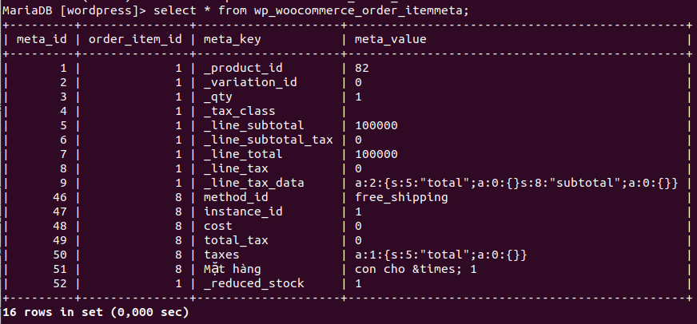

# WooCommerce
## Bài tập về cách lưu dữ liệu trong Shopping Cart
- Sau khi đã cài đặt và tìm hiểu quá về các Shopping Cart, hãy kể tên các bảng lưu thông tin của các entity sau (Category, Product, Customer, Order) của một Shopping Cart bất kỳ (Magento, WooCommere, PrestaShop)

Ví dụ: 
Thông tin product lưu trong các bảng: products, product_category,...
### Wordpress db

### Category

### Product 
- Sản phẩm sẽ lưu trong wp_posts và wp_postmeta
- lưu trữ các thông tin chính trong wp_posts
- Metadata của sản phẩm sẽ lưu trong wp_postmeta
#### Thông tin bảng wp_posts như sau:
<table class="widefat">

<tbody><tr style="background:#464646; color:#d7d7d7;">
<th>Field</th>
<th>Type</th>
<th>Null</th>
<th>Key</th>
<th>Default</th>
<th>Extra
</th></tr>
<tr>
<td>ID</td>
<td>bigint(20) unsigned</td>
<td>&nbsp;</td>
<td>PRI &amp; IND Pt4</td>
<td>&nbsp;</td>
<td>auto_increment
</td></tr>
<tr>
<td>post_author</td>
<td>bigint(20) unsigned</td>
<td>&nbsp;</td>
<td>IND</td>
<td>0</td>
<td>&nbsp;
</td></tr>
<tr>
<td>post_date</td>
<td>datetime</td>
<td>&nbsp;</td>
<td>IND Pt3</td>
<td>0000-00-00 00:00:00</td>
<td>&nbsp;
</td></tr>
<tr>
<td>post_date_gmt</td>
<td>datetime</td>
<td>&nbsp;</td>
<td>&nbsp;</td>
<td>0000-00-00 00:00:00</td>
<td>&nbsp;
</td></tr>
<tr>
<td>post_content</td>
<td>longtext</td>
<td>&nbsp;</td>
<td>&nbsp;</td>
<td>&nbsp;</td>
<td>&nbsp;
</td></tr>
<tr>
<td>post_title</td>
<td>text</td>
<td>&nbsp;</td>
<td>&nbsp;</td>
<td>&nbsp;</td>
<td>&nbsp;
</td></tr>
<tr>
<td>post_excerpt</td>
<td>text</td>
<td>&nbsp;</td>
<td>&nbsp;</td>
<td>&nbsp;</td>
<td>&nbsp;
</td></tr>
<tr>
<td>post_status</td>
<td>varchar(20)</td>
<td>&nbsp;</td>
<td>IND PT2</td>
<td>publish</td>
<td>&nbsp;
</td></tr>
<tr>
<td>comment_status</td>
<td>varchar(20)</td>
<td>&nbsp;</td>
<td>&nbsp;</td>
<td>open</td>
<td>&nbsp;
</td></tr>
<tr>
<td>ping_status</td>
<td>varchar(20)</td>
<td>&nbsp;</td>
<td>&nbsp;</td>
<td>open</td>
<td>&nbsp;
</td></tr>
<tr>
<td>post_password</td>
<td>varchar(20)</td>
<td>&nbsp;</td>
<td>&nbsp;</td>
<td>&nbsp;</td>
<td>&nbsp;
</td></tr>
<tr>
<td>post_name</td>
<td>varchar(200)</td>
<td>&nbsp;</td>
<td>IND</td>
<td>&nbsp;</td>
<td>&nbsp;
</td></tr>
<tr>
<td>to_ping</td>
<td>text</td>
<td>&nbsp;</td>
<td>&nbsp;</td>
<td>&nbsp;</td>
<td>&nbsp;
</td></tr>
<tr>
<td>pinged</td>
<td>text</td>
<td>&nbsp;</td>
<td>&nbsp;</td>
<td>&nbsp;</td>
<td>&nbsp;
</td></tr>
<tr>
<td>post_modified</td>
<td>datetime</td>
<td>&nbsp;</td>
<td>&nbsp;</td>
<td>0000-00-00 00:00:00</td>
<td>&nbsp;
</td></tr>
<tr>
<td>post_modified_gmt</td>
<td>datetime</td>
<td>&nbsp;</td>
<td>&nbsp;</td>
<td>0000-00-00 00:00:00</td>
<td>&nbsp;
</td></tr>
<tr>
<td>post_content_filtered</td>
<td>longtext</td>
<td>&nbsp;</td>
<td>&nbsp;</td>
<td>&nbsp;</td>
<td>
</td></tr>
<tr>
<td>post_parent</td>
<td>bigint(20) unsigned</td>
<td>&nbsp;</td>
<td>IND</td>
<td>0</td>
<td>&nbsp;
</td></tr>
<tr>
<td>guid</td>
<td>varchar(255)</td>
<td>&nbsp;</td>
<td>&nbsp;</td>
<td>&nbsp;</td>
<td>&nbsp;
</td></tr>
<tr>
<td>menu_order</td>
<td>int(11)</td>
<td>&nbsp;</td>
<td>&nbsp;</td>
<td>0</td>
<td>&nbsp;
</td></tr>
<tr>
<td>post_type</td>
<td>varchar(20)</td>
<td>&nbsp;</td>
<td>IND Pt1</td>
<td>post</td>
<td>&nbsp;
</td></tr>
<tr>
<td>post_mime_type</td>
<td>varchar(100)</td>
<td>&nbsp;</td>
<td>&nbsp;</td>
<td>&nbsp;</td>
<td>&nbsp;
</td></tr>
<tr>
<td>comment_count</td>
<td>bigint(20)</td>
<td>&nbsp;</td>
<td>&nbsp;</td>
<td>0</td>
<td>&nbsp;
</td></tr></tbody></table>

#### Thông tin bảng wp_postmeta như sau:
<table class="widefat">

<tbody><tr style="background:#464646; color:#d7d7d7;">
<th>Field</th>
<th>Type</th>
<th>Null</th>
<th>Key</th>
<th>Default</th>
<th>Extra
</th></tr>
<tr>
<td>meta_id</td>
<td>bigint(20)  unsigned</td>
<td>&nbsp;</td>
<td>PRI</td>
<td>&nbsp;</td>
<td>auto_increment
</td></tr>
<tr>
<td>post_id</td>
<td>bigint(20)  unsigned</td>
<td>&nbsp;</td>
<td>IND</td>
<td>0</td>
<td>&nbsp;
</td></tr>
<tr>
<td>meta_key</td>
<td>varchar(255)</td>
<td>YES</td>
<td>IND</td>
<td>NULL</td>
<td>&nbsp;
</td></tr>
<tr>
<td>meta_value</td>
<td>longtext</td>
<td>YES</td>
<td>&nbsp;</td>
<td>NULL</td>
<td>&nbsp;
</td></tr></tbody></table>

#### Truy vấn lấy thông tin sản phẩm từ wp_posts

### Customer 

### Order

