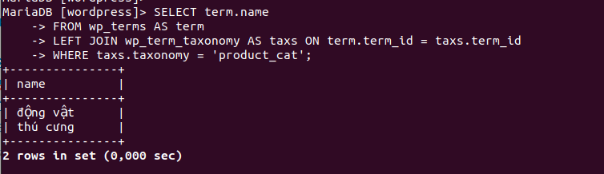

# WooCommerce
## Bài tập về cách lưu dữ liệu trong Shopping Cart
- Sau khi đã cài đặt và tìm hiểu quá về các Shopping Cart, hãy kể tên các bảng lưu thông tin của các entity sau (Category, Product, Customer, Order) của một Shopping Cart bất kỳ (Magento, WooCommere, PrestaShop)

Ví dụ: 
Thông tin product lưu trong các bảng: products, product_category,...
Woocommerce:
- Ảnh của product được lưu như nào trong database?

  Ảnh sẽ được save vào folder trong src và trong wp_posts có trường guid lưu đường dẫn đến ảnh.
  
- Category link với product như nào? Viết câu query để lấy ra toàn bộ category name của một products với ID cho trước.

  Category link với product thông qua bảng wp_term_relationships khi add product vào category

  Query:
  ```
  SELECT object_id AS product_id, tt.term_id AS category_id, name AS category_name
  FROM wp_term_relationships AS rel
  LEFT JOIN wp_term_taxonomy AS tt ON rel.term_taxonomy_id = tt.term_taxonomy_id
  LEFT JOIN wp_terms AS terms ON terms.term_id = tt.term_id
  WHERE object_id = 82
  ```

- Nêu cách để attribute tạo product variants.
- 
- Viết câu query xoá sạch order + product
Query xóa product:
```
DELETE relations.*, taxes.*, terms.*
FROM wp_term_relationships AS relations
INNER JOIN wp_term_taxonomy AS taxes
ON relations.term_taxonomy_id=taxes.term_taxonomy_id
INNER JOIN wp_terms AS terms
ON taxes.term_id=terms.term_id
WHERE object_id IN (SELECT ID FROM wp_posts WHERE post_type='product');

DELETE FROM wp_postmeta WHERE post_id IN (SELECT ID FROM wp_posts WHERE post_type = 'product');
DELETE FROM wp_posts WHERE post_type = 'product';
```

Query xóa orders:
```
DELETE FROM wp_woocommerce_order_itemmeta;
DELETE FROM wp_woocommerce_order_items;
DELETE FROM wp_wc_orders;
DELETE FROM wp_wc_order_addresses;
DELETE FROM wp_wc_order_coupon_lookup;
DELETE FROM wp_wc_order_operational_data;
DELETE FROM wp_wc_order_product_lookup;
DELETE FROM wp_wc_orders_meta;
DELETE FROM wp_wc_order_stats;
DELETE FROM wp_comments WHERE comment_type = 'order_note';
DELETE FROM wp_postmeta WHERE post_id IN ( SELECT ID FROM wp_posts WHERE post_type = 'shop_order_placehold' );
DELETE FROM wp_posts WHERE post_type = 'shop_order_placehold';
```

### Wordpress db


### Category
Danh mục sản phẩm được lưu trong wp_terms, wp_term_taxnomy, wp_term_relationships
- Lưu trong wp_terms, bảng này lưu thông tin cơ bản của từng danh mục như id, tên, slug(bản thân thiện với url - kiểu đuôi url)
- wp_term_taxnomy: lưu trữ id danh mục và loại thuật ngữ
- wp_term_relationships: bảng tạo mối quan hệ giữa sản phẩm và danh mục, có 2 trường object_id là id sản phẩm, term_taxonomy_id là id category.
#### Bảng wp_terms
<table class="widefat">

<tbody><tr style="background:#464646; color:#d7d7d7;">
<th>Field</th>
<th>Type</th>
<th>Null</th>
<th>Key</th>
<th>Default</th>
<th>Extra
</th></tr>
<tr>
<td>term_id</td>
<td>bigint(20)  unsigned</td>
<td>&nbsp;</td>
<td>PRI</td>
<td>&nbsp;</td>
<td>auto_increment
</td></tr>
<tr>
<td>name</td>
<td>varchar(200)</td>
<td>&nbsp;</td>
<td>IND</td>
<td>&nbsp;</td>
<td>&nbsp;
</td></tr>
<tr>
<td>slug</td>
<td>varchar(200)</td>
<td>&nbsp;</td>
<td>MUL</td>
<td>&nbsp;</td>
<td>&nbsp;
</td></tr>
<tr>
<td>term_group</td>
<td>bigint(10)</td>
<td>&nbsp;</td>
<td>&nbsp;</td>
<td>0</td>
<td>&nbsp;
</td></tr></tbody></table>

#### bảng wp_term_taxnomy
<table class="widefat">

<tbody><tr style="background:#464646; color:#d7d7d7;">
<th>Field</th>
<th>Type</th>
<th>Null</th>
<th>Key</th>
<th>Default</th>
<th>Extra
</th></tr>
<tr>
<td>term_taxonomy_id</td>
<td>bigint(20)  unsigned</td>
<td>&nbsp;</td>
<td>PRI</td>
<td>&nbsp;</td>
<td>auto_increment
</td></tr>
<tr>
<td>term_id</td>
<td>bigint(20)  unsigned</td>
<td>&nbsp;</td>
<td>UNI Pt1</td>
<td>0 </td>
<td>&nbsp;
</td></tr>
<tr>
<td>taxonomy</td>
<td>varchar(32)</td>
<td>&nbsp;</td>
<td>UNI Pt2 &amp; IND</td>
<td>&nbsp;</td>
<td>&nbsp;
</td></tr>
<tr>
<td>description</td>
<td>longtext</td>
<td>&nbsp;</td>
<td>&nbsp;</td>
<td>&nbsp;</td>
<td>&nbsp;
</td></tr>
<tr>
<td>parent</td>
<td>bigint(20)  unsigned</td>
<td>&nbsp;</td>
<td>&nbsp;</td>
<td>0</td>
<td>&nbsp;
</td></tr>
<tr>
<td>count</td>
<td>bigint(20)</td>
<td>&nbsp;</td>
<td>&nbsp;</td>
<td>0</td>
<td>&nbsp;
</td></tr>
</tbody></table>

#### bảng wp_term_relationships
<table class="widefat">

<tbody><tr style="background:#464646; color:#d7d7d7;">
<th>Field</th>
<th>Type</th>
<th>Null</th>
<th>Key</th>
<th>Default</th>
<th>Extra
</th></tr>
<tr>
<td>object_id</td>
<td>bigint(20)  unsigned</td>
<td>&nbsp;</td>
<td>PRI Pt1</td>
<td>0</td>
<td>&nbsp;
</td></tr>
<tr>
<td>term_taxonomy_id</td>
<td>bigint(20)  unsigned</td>
<td>&nbsp;</td>
<td>PRI Pt2 &amp; IND</td>
<td>0</td>
<td>&nbsp;
</td></tr>
<tr>
<td>term_order</td>
<td>int(11)</td>
<td>&nbsp;</td>
<td>&nbsp;</td>
<td>0</td>
<td>&nbsp;
</td></tr></tbody></table>

#### lấy thông tin category trong wp_terms  

### Product 
Sản phẩm sẽ lưu trong wp_posts và wp_postmeta
- lưu trữ các thông tin chính trong wp_posts
- Metadata của sản phẩm sẽ lưu trong wp_postmeta
#### Thông tin bảng wp_posts như sau:
<table class="widefat">

<tbody><tr style="background:#464646; color:#d7d7d7;">
<th>Field</th>
<th>Type</th>
<th>Null</th>
<th>Key</th>
<th>Default</th>
<th>Extra
</th></tr>
<tr>
<td>ID</td>
<td>bigint(20) unsigned</td>
<td>&nbsp;</td>
<td>PRI &amp; IND Pt4</td>
<td>&nbsp;</td>
<td>auto_increment
</td></tr>
<tr>
<td>post_author</td>
<td>bigint(20) unsigned</td>
<td>&nbsp;</td>
<td>IND</td>
<td>0</td>
<td>&nbsp;
</td></tr>
<tr>
<td>post_date</td>
<td>datetime</td>
<td>&nbsp;</td>
<td>IND Pt3</td>
<td>0000-00-00 00:00:00</td>
<td>&nbsp;
</td></tr>
<tr>
<td>post_date_gmt</td>
<td>datetime</td>
<td>&nbsp;</td>
<td>&nbsp;</td>
<td>0000-00-00 00:00:00</td>
<td>&nbsp;
</td></tr>
<tr>
<td>post_content</td>
<td>longtext</td>
<td>&nbsp;</td>
<td>&nbsp;</td>
<td>&nbsp;</td>
<td>&nbsp;
</td></tr>
<tr>
<td>post_title</td>
<td>text</td>
<td>&nbsp;</td>
<td>&nbsp;</td>
<td>&nbsp;</td>
<td>&nbsp;
</td></tr>
<tr>
<td>post_excerpt</td>
<td>text</td>
<td>&nbsp;</td>
<td>&nbsp;</td>
<td>&nbsp;</td>
<td>&nbsp;
</td></tr>
<tr>
<td>post_status</td>
<td>varchar(20)</td>
<td>&nbsp;</td>
<td>IND PT2</td>
<td>publish</td>
<td>&nbsp;
</td></tr>
<tr>
<td>comment_status</td>
<td>varchar(20)</td>
<td>&nbsp;</td>
<td>&nbsp;</td>
<td>open</td>
<td>&nbsp;
</td></tr>
<tr>
<td>ping_status</td>
<td>varchar(20)</td>
<td>&nbsp;</td>
<td>&nbsp;</td>
<td>open</td>
<td>&nbsp;
</td></tr>
<tr>
<td>post_password</td>
<td>varchar(20)</td>
<td>&nbsp;</td>
<td>&nbsp;</td>
<td>&nbsp;</td>
<td>&nbsp;
</td></tr>
<tr>
<td>post_name</td>
<td>varchar(200)</td>
<td>&nbsp;</td>
<td>IND</td>
<td>&nbsp;</td>
<td>&nbsp;
</td></tr>
<tr>
<td>to_ping</td>
<td>text</td>
<td>&nbsp;</td>
<td>&nbsp;</td>
<td>&nbsp;</td>
<td>&nbsp;
</td></tr>
<tr>
<td>pinged</td>
<td>text</td>
<td>&nbsp;</td>
<td>&nbsp;</td>
<td>&nbsp;</td>
<td>&nbsp;
</td></tr>
<tr>
<td>post_modified</td>
<td>datetime</td>
<td>&nbsp;</td>
<td>&nbsp;</td>
<td>0000-00-00 00:00:00</td>
<td>&nbsp;
</td></tr>
<tr>
<td>post_modified_gmt</td>
<td>datetime</td>
<td>&nbsp;</td>
<td>&nbsp;</td>
<td>0000-00-00 00:00:00</td>
<td>&nbsp;
</td></tr>
<tr>
<td>post_content_filtered</td>
<td>longtext</td>
<td>&nbsp;</td>
<td>&nbsp;</td>
<td>&nbsp;</td>
<td>
</td></tr>
<tr>
<td>post_parent</td>
<td>bigint(20) unsigned</td>
<td>&nbsp;</td>
<td>IND</td>
<td>0</td>
<td>&nbsp;
</td></tr>
<tr>
<td>guid</td>
<td>varchar(255)</td>
<td>&nbsp;</td>
<td>&nbsp;</td>
<td>&nbsp;</td>
<td>&nbsp;
</td></tr>
<tr>
<td>menu_order</td>
<td>int(11)</td>
<td>&nbsp;</td>
<td>&nbsp;</td>
<td>0</td>
<td>&nbsp;
</td></tr>
<tr>
<td>post_type</td>
<td>varchar(20)</td>
<td>&nbsp;</td>
<td>IND Pt1</td>
<td>post</td>
<td>&nbsp;
</td></tr>
<tr>
<td>post_mime_type</td>
<td>varchar(100)</td>
<td>&nbsp;</td>
<td>&nbsp;</td>
<td>&nbsp;</td>
<td>&nbsp;
</td></tr>
<tr>
<td>comment_count</td>
<td>bigint(20)</td>
<td>&nbsp;</td>
<td>&nbsp;</td>
<td>0</td>
<td>&nbsp;
</td></tr></tbody></table>

#### Thông tin bảng wp_postmeta như sau:
<table class="widefat">

<tbody><tr style="background:#464646; color:#d7d7d7;">
<th>Field</th>
<th>Type</th>
<th>Null</th>
<th>Key</th>
<th>Default</th>
<th>Extra
</th></tr>
<tr>
<td>meta_id</td>
<td>bigint(20)  unsigned</td>
<td>&nbsp;</td>
<td>PRI</td>
<td>&nbsp;</td>
<td>auto_increment
</td></tr>
<tr>
<td>post_id</td>
<td>bigint(20)  unsigned</td>
<td>&nbsp;</td>
<td>IND</td>
<td>0</td>
<td>&nbsp;
</td></tr>
<tr>
<td>meta_key</td>
<td>varchar(255)</td>
<td>YES</td>
<td>IND</td>
<td>NULL</td>
<td>&nbsp;
</td></tr>
<tr>
<td>meta_value</td>
<td>longtext</td>
<td>YES</td>
<td>&nbsp;</td>
<td>NULL</td>
<td>&nbsp;
</td></tr></tbody></table>

#### Truy vấn lấy thông tin sản phẩm từ wp_posts

### Customer 
Customer được lưu trong wp_users và wp_usermeta(chưa thông tin các id)
#### Bảng wp_users
<table class="widefat">

<tbody><tr style="background:#464646; color:#d7d7d7;">
<th>Field</th>
<th>Type</th>
<th>Null</th>
<th>Key</th>
<th>Default</th>
<th>Extra
</th></tr>
<tr>
<td>ID</td>
<td>bigint(20) unsigned</td>
<td>&nbsp;</td>
<td>PRI</td>
<td>&nbsp;</td>
<td>auto_increment
</td></tr>
<tr>
<td>user_login</td>
<td>varchar(60)</td>
<td>&nbsp;</td>
<td>IND</td>
<td>&nbsp;</td>
<td>&nbsp;
</td></tr>
<tr>
<td>user_pass</td>
<td>varchar(64)</td>
<td>&nbsp;</td>
<td>&nbsp;</td>
<td>&nbsp;</td>
<td>&nbsp;
</td></tr>
<tr>
<td>user_nicename</td>
<td>varchar(50)</td>
<td>&nbsp;</td>
<td>IND</td>
<td>&nbsp;</td>
<td>&nbsp;
</td></tr>
<tr>
<td>user_email</td>
<td>varchar(100)</td>
<td>&nbsp;</td>
<td>&nbsp;</td>
<td>&nbsp;</td>
<td>&nbsp;
</td></tr>
<tr>
<td>user_url</td>
<td>varchar(100)</td>
<td>&nbsp;</td>
<td>&nbsp;</td>
<td>&nbsp;</td>
<td>&nbsp;
</td></tr>
<tr>
<td>user_registered</td>
<td>datetime</td>
<td>&nbsp;</td>
<td>&nbsp;</td>
<td>0000-00-00 00:00:00</td>
<td>&nbsp;
</td></tr>
<tr>
<td>user_activation_key</td>
<td>varchar(60)</td>
<td>&nbsp;</td>
<td>&nbsp;</td>
<td>&nbsp;</td>
<td>
</td></tr>
<tr>
<td>user_status</td>
<td>int(11)</td>
<td>&nbsp;</td>
<td>&nbsp;</td>
<td>0</td>
<td>&nbsp;
</td></tr>
<tr>
<td>display_name</td>
<td>varchar(250)</td>
<td>&nbsp;</td>
<td>&nbsp;</td>
<td>&nbsp; </td>
<td>&nbsp;
</td></tr></tbody></table>

#### Truy vấn lấy ra thông tin user

### Order

